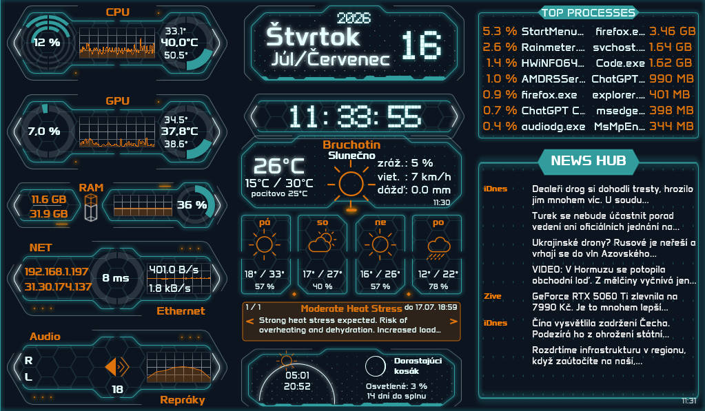

# TronMCP Rainmeter Suite

## Overview
Reworked Rainmaster Tron-MCP skin. Removed some widgets, edited, reworked.

Currently containing widgets:
- Audio
- Background
- CPU
- Date
- GPU
- NET
- NewsHub
- RAM
- Time
- Top
- WeatherAstro



*(Picture provided is my translated version with filled API keys. Version in this repo is in English.)*

## Initial setup

### WeatherAstro
Open the WeatherAstro configuration (`WeatherAstro\WeatherAstro.ini`) and replace:
`ENTER_YOUR_API_KEY`
with your own weather provider API key.

### NewsHub
Edit:
`NewsHub/Feeds.txt`

Format:
```
Title|https://example.com/rss
```

One feed per line.

## Localization
Option `Localise=cs` didn't really worked for me in most of the widgets, so I used `Substitute`. This is used in `Date/Date.ini`. Just replace second part of every pair with you language variant.
WeatherAstro is using `weatherapi`, where you can set your language. In `WeatherAstro/WeatherAstro.ini` set value `WeatherLanguage` to your desired language. Consult official [weatherapi documentation](https://www.weatherapi.com/docs/).

### HWiNFO
Install HWiNFO with Shared Memory enabled.
Open HWiNFO Shared Memory Viewer from the skin context menu to verify sensor IDs if needed.

## Requirements
- Rainmeter 4.5+
- HWiNFO (for CPU/GPU sensors)
- PowerShell 7 recommended

## Credits

This project is based on the original [Rainmeter Tron-MCP](https://github.com/mistic100/Rainmeter-Tron-MCP) Rainmeter suite.
Many thanks to the original author for creating the foundation that this project builds upon.

## License
MIT License

Permission is hereby granted, free of charge, to any person obtaining a copy of this software and associated documentation files (the "Software"), to deal in the Software without restriction, including without limitation the rights to use, copy, modify, merge, publish, distribute, sublicense, and/or sell copies of the Software, and to permit persons to whom the Software is furnished to do so, subject to the following conditions:

The above copyright notice and this permission notice shall be included in all copies or substantial portions of the Software.

THE SOFTWARE IS PROVIDED "AS IS", WITHOUT WARRANTY OF ANY KIND, EXPRESS OR IMPLIED, INCLUDING BUT NOT LIMITED TO THE WARRANTIES OF MERCHANTABILITY, FITNESS FOR A PARTICULAR PURPOSE AND NONINFRINGEMENT. IN NO EVENT SHALL THE AUTHORS OR COPYRIGHT HOLDERS BE LIABLE FOR ANY CLAIM, DAMAGES OR OTHER LIABILITY, WHETHER IN AN ACTION OF CONTRACT, TORT OR OTHERWISE, ARISING FROM, OUT OF OR IN CONNECTION WITH THE SOFTWARE OR THE USE OR OTHER DEALINGS IN THE SOFTWARE.
